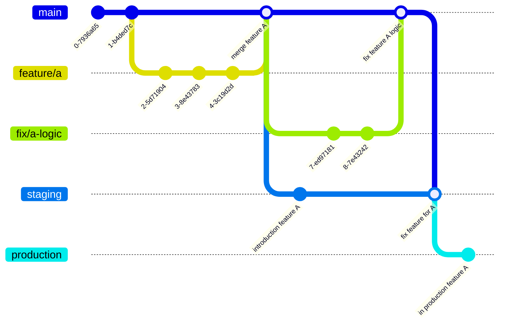

# Rise - GENT2

## Team Members

- Bram Rampelberg - <bram.rampelberg@student.hogent.be> - BramRampelberg
- Xan Pinson - <xan.pinson@student.hogent.be> - Snowyxa
- Pushwant Sagoo - <pushwant.sagoo@student.hogent.be> - PushwantSagoo
- Sujan Sapkota - <sujan.sapkota@student.hogent.be> - sujansapkota2
- Simon De Roeve - <simon.deroeve@student.hogent.be> - SimonDeRoeve
- Bas Stokmans - <bas.stokmans@student.hogent.be> - baziniser
- Bindo Thorpe - <bindo.thorpe@student.hogent.be> - bindothorpe

## Technologies & Packages Used

- [Postgres 16.4](https://www.postgresql.org/) - Database
- [Blazor](https://dotnet.microsoft.com/en-us/apps/aspnet/web-apps/blazor) - Frontend
- [ASP.NET 8](https://dotnet.microsoft.com/en-us/apps/aspnet) - Backend
- [Entity Framework 8](https://learn.microsoft.com/en-us/ef/) - Database Access
- [EntityFrameworkCore Triggered](https://github.com/koenbeuk/EntityFrameworkCore.Triggered) - Database Triggers
- [Npgsql Entity Framework Core](https://www.npgsql.org/index.html)
- [User Secrets](https://docs.microsoft.com/en-us/aspnet/core/security/app-secrets) - Securely store secrets in DEV.
- [GuardClauses](https://github.com/ardalis/GuardClauses) - Validation Helper
- [Playwright](https://playwright.dev/dotnet/) - E2E tests
- [xUnit](https://xunit.net) - (Unit) Testing
- [nSubstitute](https://nsubstitute.github.io) - Mocking for testing
- [Shouldly](https://docs.shouldly.org) - Helper for testing
- [AspNetCore MVC testing](https://www.nuget.org/packages/Microsoft.AspNetCore.Mvc.Testing) - Integration testing

## Running the application

### Installation Instructions

> Note: Initially the database will not exist, so you will need to run the migrations to [create the database](#creation-of-the-database).

1. Clone the repository
2. Open the `Rise.sln` file in Visual Studio or Visual Studio Code
3. Set up the database connection
4. Run the project using the `Rise.Server` project as the startup project: `dotnet run --project Rise.Server`
5. The project should open in your default browser on port 5001.

### Running In Production

To run the application in the `production` environment, add the following argument to the `dotnet run` command:

```bash
--environment Production
```

For changing the urls the server is running can be specified via the argument `--urls` like so:

```bash
--urls "https://localhost:5100;http://localhost:5200"
```

So the resulting `run` command would be something along the lines of:

```bash
dotnet run --project Rise.Server --environment Production --urls "https://0.0.0.0:5100"
```

For more info on running the application in a specifying environment, check out the ASP.NET docs on [Using multiple environments in ASP.NET Core](https://learn.microsoft.com/en-us/aspnet/core/fundamentals/environments?view=aspnetcore-8.0) and the general [`dotnet run`](https://learn.microsoft.com/en-us/dotnet/core/tools/dotnet-run) commando.

### Add Auth0 environment variables to appsettings.json and secrets to secrets.json

```
"Auth0": {
    "Authority": "https://rise-gent2.eu.auth0.com",
    "Audience": "https://api.buut.be",
    "ApiIdentifier": "https://rise-gent2.eu.auth0.com/api/v2/",
    "M2MClientId": "h5pei396blZJIqvOSHDfiK5AykyWe63S",
    "M2MClientSecret": "<secret>",
    "BlazorClientId": "8vJtbXg2FptHGmKrpFl1tZwhiXOJZ57l",
    "BlazorClientSecret": "<secret>"
  },
```

## Contribution

### Branching flow

This project uses feature branches to introduce new features into `main`.
On top of this the following is used to keep up the CI/CD pipeline:

| Name              | Base Branch         | Protected | Description         |
| ----------------- | ------------------- | --------- | ------------------- |
| `feature/**`      | `main`              | `false`   | Feature branch(s) where a new feature/requests developed on for the application. |
| `fix/**`      | `main`              | `false`   | Fix branch(s) that solve problems in the application. |
| `refactor/**`      | `main`              | `false`   | Refactor branch(s) that solve structural problems. |
| `docs/**`      | `main`              | `false`   | Documentation branch(s) that expand/clarify documentation. |
| `main`            | NONE                | `true`    | General development. Here all of the features, (hot) fixes and documentation get merged into via pull requests. |
| `staging`         | `main`              | `true`    | Environment where the lasts checks and manual tests get applied on before it moves on to production. Main reason for existing is allowing the Android application to use actual integrations. Only updates when automatic testing succeeds and with enough tests for all current/new features.                  |
| `production`      | `staging`           | `true`    | Environment where the current latest stable version. Gets used in the CI/CD pipeline to host the newest version. Only updates when succeeds lasts checks and approved by majority                      |

For example the development flow of an abstract feature A to production:



Feature *A* gets developed in it's respective feature branch `feature/a`. When it is done that feature ends up into `main` after approval. Which after goes to `staging` since its test succeeds. However during its lasts (manual) check ups, a mistake is noticed. This gets solved in the `fix/a` branch, which then goes back through the flow of going by `main` to `staging`. Now the feature is truly done finished and can end up on the `production` branch.

## Database

### Database connection

Add the database connection string as a secret in the `Rise.Server` project via [.NET core User secrets](https://marketplace.visualstudio.com/items?itemName=adrianwilczynski.user-secrets) extension, by right-click on the `Rise.Server.csproj` and selecting `Manage User Secrets`.
Add in given values and alter where needed in the connection string:

```json
{
  "ConnectionStrings": {
    "PostgreSQL": "User ID=[USER];Password=[PASSWORD];Host=localhost;Port=5432;Database=Hogent.Rise;Connection Lifetime=0;"
  }
}
```

Alternative you could achieve the same via the CLI. Be present in the `Rise.Server` project and again alter values where needed in the connection string:

```Bash
dotnet user-secrets set ConnectionStrings:PostgreSQL "User ID=[USER];Password=[PASSWORD];Host=localhost;Port=5432;Database=Hogent.Rise;Connection Lifetime=0;"
```

### Creation of the database

To create the database, run the following command in the main folder `Rise`

```bash
dotnet ef database update --startup-project Rise.Server --project Rise.Persistence
```

> Make sure your database configuration is [correctly setup](#database-connection).

Note: if you have troubles with EF, don't forget to install it via `dotnet tool install --global dotnet-ef`

### Migrations

#### Adding Migrations

Adapting the database schema can be done using migrations. To create a new migration, run the following command:

```bash
dotnet ef migrations add [MIGRATION_NAME] --startup-project Rise.Server --project Rise.Persistence
```

And then update the database to the latest migration using the following command:

```bash
dotnet ef database update --startup-project Rise.Server --project Rise.Persistence
```

#### Removing Migrations

Updating to a specific migration using:

```bash
dotnet ef database update [MIGRATION_NAME] --startup-project Rise.Server --project Rise.Persistence
```

Now the latest migration can be removed via:

```bash
dotnet ef migrations remove --startup-project Rise.Server --project Rise.Persistence
```

## Testing

| Type of test  | Project  | Reason        | Framework        |  Runner        | Additional setup        |
| ------------- | ------------- | ------------- | ------------- | ------------- | ------------- |
| [Unit](#unit-tests)          | `Rise.Domain.Tests`          | Testing the domain | Built in | [xUnit](https://xunit.net) | None |
| [Integration](#integration-tests)   | `Rise.Server.Tests`   | Testing the back-end | [AspNetCore MVC testing](https://www.nuget.org/packages/Microsoft.AspNetCore.Mvc.Testing) | [xUnit](https://xunit.net) | Test Postgres database set-up |
| [E2E](#e2e-tests)  | `Rise.Client.Tests`  | Testing the front-end | [Playwright](https://playwright.dev/dotnet/) | [NUnit](https://nunit.org/) | Playwright must be installed and client must be running |

Additional tools used to help write tests:

- [nSubstitute](https://nsubstitute.github.io) - Mocking for testing
- [Shouldly](https://docs.shouldly.org) - Helper for testing (asserts)

In general to start testing use the following command:

```bash
dotnet test
```

> Some testing projects require more setup, please read further if this is your first time testing.

### Unit Tests

In the `Rise.Domain.Tests` project run the following:

```bash
dotnet test
```

XUnit test runner will go through all of the tests.

### Integration Tests

#### Test database setup

> !!!! It is important that the database is different from the application database is this will be ***dropped*** and re-created automatically during tests to ensure the correct state !!!!

There are two ways to specify the database connection:

1) .NET secrets:

This setup is very similar to the setup of the [application's database](#database-connection). Only difference is that the secrets need to be added to the `Rise.Server.Tests` project. Preferably with the database being `Hogent.Rise.Test` to make a distinction.

2) Environment variable:

> Powershell

```
env:ConnectionStrings__PostgreSQL="connection here"
env:Auth0__Authority= "https://rise-gent2.eu.auth0.com",
env:Auth0__Audience= "https://api.buut.be",
env:Auth0__ApiIdentifier= "https://rise-gent2.eu.auth0.com/api/v2/",
env:Auth0__M2MClientId= "h5pei396blZJIqvOSHDfiK5AykyWe63S",
env:Auth0__M2MClientSecret= "<secret>",
env:Auth0__BlazorClientId= "8vJtbXg2FptHGmKrpFl1tZwhiXOJZ57l",
env:Auth0__BlazorClientSecret= "<secret>"
```

> Bash

```
ConnectionStrings__PostgreSQL="connection here"
Auth0__Authority= "https://rise-gent2.eu.auth0.com",
Auth0__Audience= "https://api.buut.be",
Auth0__ApiIdentifier= "https://rise-gent2.eu.auth0.com/api/v2/",
Auth0__M2MClientId= "h5pei396blZJIqvOSHDfiK5AykyWe63S",
Auth0__M2MClientSecret= "<secret>",
Auth0__BlazorClientId= "8vJtbXg2FptHGmKrpFl1tZwhiXOJZ57l",
Auth0__BlazorClientSecret= "<secret>"
```

#### Running integration tests

In the `Rise.Server.Tests` project run the following:

```bash
dotnet test
```

Or when the database connection needs be specified using the CLI:

> Bash

```bash
ConnectionStrings__PostgreSQL="connection here" dotnet run
```

> Powershell

```ps1
$env:ConnectionStrings__PostgreSQL="connection here"
$env:Auth0__Authority= "https://rise-gent2.eu.auth0.com",
$env:Auth0__Audience= "https://api.buut.be",
$env:Auth0__ApiIdentifier= "https://rise-gent2.eu.auth0.com/api/v2/",
$env:Auth0__M2MClientId= "h5pei396blZJIqvOSHDfiK5AykyWe63S",
$env:Auth0__M2MClientSecret= "<secret>",
$env:Auth0__BlazorClientId= "8vJtbXg2FptHGmKrpFl1tZwhiXOJZ57l",
$env:Auth0__BlazorClientSecret= "<secret>"
dotnet run
```

### E2E Tests

### Authenticated Tests Configuration

This setup is very similar to the setup of the [application's database](#database-connection). Only difference is that the secrets need to be added to the `Rise.Client.Tests` project.

1. **Add User Role and Credentials**:

- Right-click on the `Rise.Client.Tests.csproj` and select `Manage User Secrets`, add the user role and credentials in `secrets.json`.

  ```json
  {
    "Administrator": {
     "Email": "admin@example.com",
     "Password": "adminpassword"
    },
    "Guest": {
     "Email": "guest@example.com",
     "Password": "guestpassword"
    },
    "Member": {
     "Email": "test@example.com",
     "Password": "testpassword"
    }
  }
  ```

2. **Configure Auth0 Allowed Callback URLs**:

- Ensure the domain URL, where the client tests are running, is added to the *Allowed Callback URLs* (don't forget to add ***/authentication/login-callback/*** after the domain) as well as the *Logout* URLs in your Auth0 configuration.

#### Installation of Playwright

Make sure that [Playwright is fully installed](https://playwright.dev/dotnet/docs/intro). In short via `dotnet build` in the `Rise.Client` you can run initialise the setup:

```ps1
pwsh bin/Debug/net8.0/playwright.ps1 install
```

> Note: NUnit will be used as test runner, not MSTest.

#### Running of Playwright

An important note is that the Client project has to be running.

This can be done by starting the project from the root via:

```bash
dotnet run --project Rise.Client
```

> Optionally you can use the `Rise.Server` project but you will need to specify the base url for tests, see further.

Running the tests can be done executing following command in the `Rise.Client.Tests` project:

```ps1
dotnet test
```

If the url of the client is different from the default URL, be sure to specify it in the test parameters like sthe following:

> Powershell (a string literal is needed here to avoid interpretation of the shell)

```ps1
dotnet test -- --% TestRunParameters.Parameter(name="BASE_URL",value="url here")
```

> Bash

```bash
dotnet test -- TestRunParameters.Parameter(name="BASE_URL",value="url here")
```
